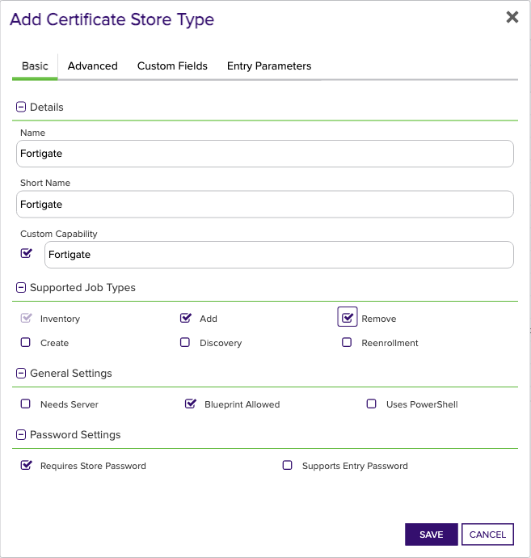
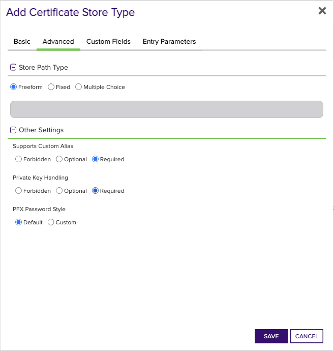

## Fortigate

The Fortigate Certificate Store Type in the Keyfactor Command platform facilitates the management of certificates specifically for Fortigate devices. This store type is designed to represent various locations within Fortigate's environment where certificates are stored and managed. It includes repositories for local user certificates and factory certificates, among others. By leveraging this Certificate Store Type, administrators can perform critical functions like inventory, addition, and removal of certificates efficiently.

There are a few important caveats to keep in mind when utilizing the Fortigate Certificate Store Type. Notably, it does not support the renewal or removal of certificates enrolled through Fortigate's internal CA, nor does it support factory certificates or any certificates bound to a Fortigate object. Additionally, this store type does not utilize an SDK.

One significant limitation is the inability to perform certificate enrollments using Fortigate's internal CA, which means Keyfactor's 'reenrollment' or 'on-device key generation' functionalities are not applicable. Users should note these constraints to avoid confusion and ensure smooth operation within the supported capabilities.


### Supported Job Types

| Job Name | Supported |
| -------- | --------- |
| Inventory | ✅ |
| Management Add | ✅ |
| Management Remove | ✅ |
| Discovery | ✅ |
| Create |  |
| Reenrollment |  |

## Requirements

### Fortigate Setup

The Fortigate Orchestrator Extension requires an API token be created in the Fortigate environment being managed.  Please review the following [instructions](https://docs.fortinet.com/document/forticonverter/7.0.1/online-help/866905/connect-fortigate-device-via-api-token) for creating an API token to be used in this integration.

### Fortigate Version Supported

The Fortigate Orchestrator Extension was tested using Fortigate, version 7.2.4


## Certificate Store Type Configuration

The recommended method for creating the `Fortigate` Certificate Store Type is to use [kfutil](https://github.com/Keyfactor/kfutil). After installing, use the following command to create the `` Certificate Store Type:

```shell
kfutil store-types create Fortigate
```

<details><summary>Fortigate</summary>

Create a store type called `Fortigate` with the attributes in the tables below:

### Basic Tab
| Attribute | Value | Description |
| --------- | ----- | ----- |
| Name | Fortigate | Display name for the store type (may be customized) |
| Short Name | Fortigate | Short display name for the store type |
| Capability | Fortigate | Store type name orchestrator will register with. Check the box to allow entry of value |
| Supported Job Types (check the box for each) | Add, Discovery, Remove | Job types the extension supports |
| Supports Add | ✅ | Check the box. Indicates that the Store Type supports Management Add |
| Supports Remove | ✅ | Check the box. Indicates that the Store Type supports Management Remove |
| Supports Discovery | ✅ | Check the box. Indicates that the Store Type supports Discovery |
| Supports Reenrollment |  |  Indicates that the Store Type supports Reenrollment |
| Supports Create |  |  Indicates that the Store Type supports store creation |
| Needs Server |  | Determines if a target server name is required when creating store |
| Blueprint Allowed | ✅ | Determines if store type may be included in an Orchestrator blueprint |
| Uses PowerShell |  | Determines if underlying implementation is PowerShell |
| Requires Store Password | ✅ | Determines if a store password is required when configuring an individual store. |
| Supports Entry Password |  | Determines if an individual entry within a store can have a password. |

The Basic tab should look like this:



### Advanced Tab
| Attribute | Value | Description |
| --------- | ----- | ----- |
| Supports Custom Alias | Required | Determines if an individual entry within a store can have a custom Alias. |
| Private Key Handling | Required | This determines if Keyfactor can send the private key associated with a certificate to the store. Required because IIS certificates without private keys would be invalid. |
| PFX Password Style | Default | 'Default' - PFX password is randomly generated, 'Custom' - PFX password may be specified when the enrollment job is created (Requires the Allow Custom Password application setting to be enabled.) |

The Advanced tab should look like this:



### Custom Fields Tab
Custom fields operate at the certificate store level and are used to control how the orchestrator connects to the remote target server containing the certificate store to be managed. The following custom fields should be added to the store type:

| Name | Display Name | Type | Default Value/Options | Required | Description |
| ---- | ------------ | ---- | --------------------- | -------- | ----------- |


The Custom Fields tab should look like this:


</details>

## Certificate Store Configuration

After creating the `Fortigate` Certificate Store Type and installing the Fortigate Universal Orchestrator extension, you can create new [Certificate Stores](https://software.keyfactor.com/Core-OnPrem/Current/Content/ReferenceGuide/Certificate%20Stores.htm?Highlight=certificate%20store) to manage certificates in the remote platform.

The following table describes the required and optional fields for the `Fortigate` certificate store type.

| Attribute | Description | Attribute is PAM Eligible |
| --------- | ----------- | ------------------------- |
| Category | Select "Fortigate" or the customized certificate store name from the previous step. | |
| Container | Optional container to associate certificate store with. | |
| Client Machine | The IP address or DNS name of the Fortigate server. For example, '192.168.1.1' or 'fortigate.example.com'. | |
| Store Path | Any arbitrary value, as the Store Path field is not used in the Fortigate integration. For example, 'defaultStorePath'. | |
| Orchestrator | Select an approved orchestrator capable of managing `Fortigate` certificates. Specifically, one with the `Fortigate` capability. | |

* **Using kfutil**

    ```shell
    # Generate a CSV template for the AzureApp certificate store
    kfutil stores import generate-template --store-type-name Fortigate --outpath Fortigate.csv

    # Open the CSV file and fill in the required fields for each certificate store.

    # Import the CSV file to create the certificate stores
    kfutil stores import csv --store-type-name Fortigate --file Fortigate.csv
    ```

* **Manually with the Command UI**: In Keyfactor Command, navigate to Certificate Stores from the Locations Menu. Click the Add button to create a new Certificate Store using the attributes in the table above.